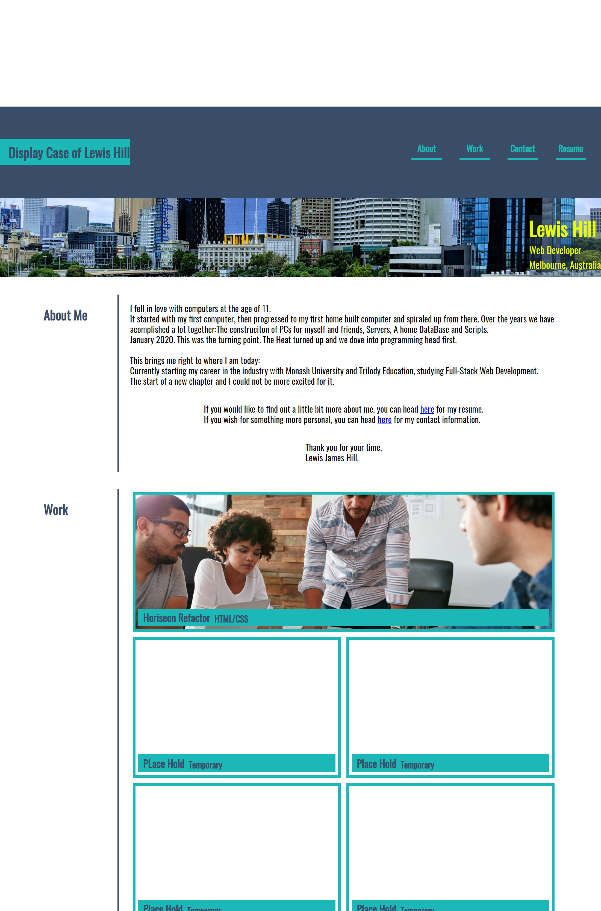

# Project-Display-Case

# User Story
```
AS AN employer
I WANT to view a potential employee's deployed portfolio of work samples
SO THAT I can review samples of their work and assess whether they're a good candidate for an open position
```

# Acceptance Criteria
```
GIVEN I need to sample a potential employee's previous work
WHEN I load their portfolio
THEN I am presented with the developer's name, a recent photo, and links to sections about them, their work, and how to contact them
WHEN I click one of the links in the navigation
THEN the UI scrolls to the corresponding section
WHEN I click on the link to the section about their work
THEN the UI scrolls to a section with titled images of the developer's applications
WHEN I am presented with the developer's first application
THEN that application's image should be larger in size than the others
WHEN I click on the images of the applications
THEN I am taken to that deployed application
WHEN I resize the page or view the site on various screens and devices
THEN I am presented with a responsive layout that adapts to my viewport
```


# Introduction

This Project will provide a personal landing page for my web development portfolio, a personal Display Case if you will or an electronic one at least.
When visiting this page you will be able to view my up to date resume, a small about me section and of course find a variety of ways to contact me and of course be able to view my completed projects.


# Live Version 
The live version of the project can be found [Here](https://lewy192.github.io/Project-Display-Case/)


# Screenshot




## Extra Notes

I tried to keep the html as semantic as possible and css as commented as possible. Both will be updated in the future.


## Acknowledgements
- reset.css can be found [here](https://gist.github.com/DavidWells/18e73022e723037a50d6) it DOES NOT belong to me NOR am i trying to pass it off as my work.

- [border bottoms](https://www.steckinsights.com/shorten-length-border-bottom-pure-css/)

- [Auto Margins for the nav bar](https://css-tricks.com/how-auto-margins-work-in-flexbox/)
- [:hover docs](https://developer.mozilla.org/en-US/docs/Web/CSS/:hover)
- [Hero Image](https://www.w3schools.com/howto/howto_css_hero_image.asp)

